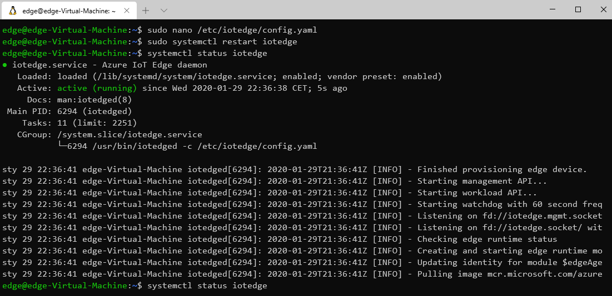
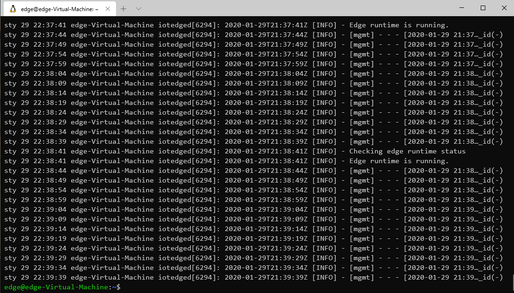
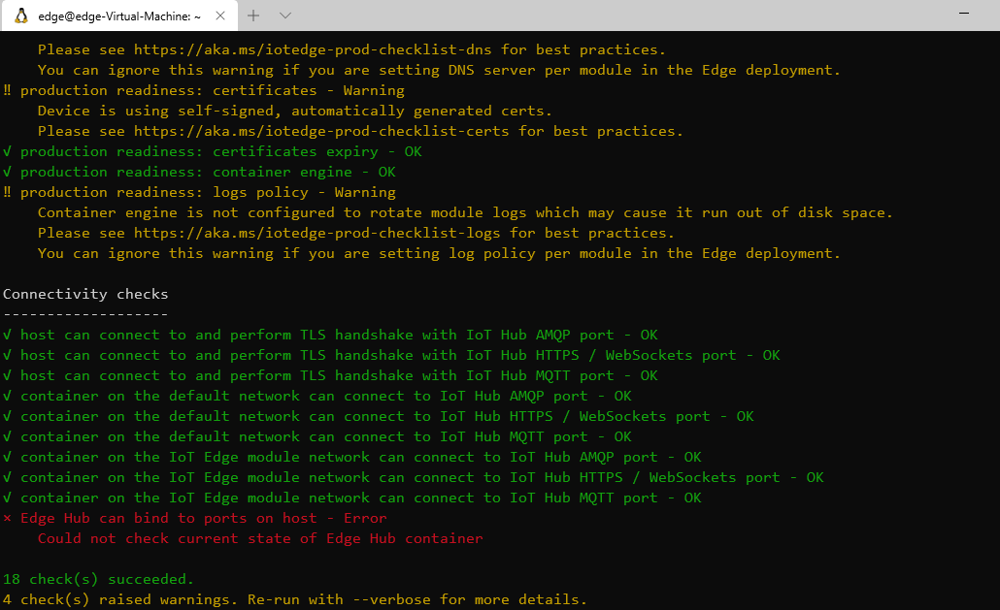
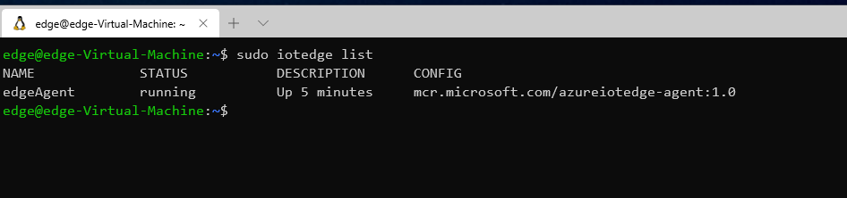

# Demo 01

# Install Azure IoT Edge on Ubuntu 18.04.3 LTS


## Register Microsoft key and software repository feed

```
sudo apt-get update
sudo apt install curl -y
curl https://packages.microsoft.com/config/ubuntu/18.04/multiarch/prod.list > ./microsoft-prod.list
sudo cp ./microsoft-prod.list /etc/apt/sources.list.d/
curl https://packages.microsoft.com/keys/microsoft.asc | gpg --dearmor > microsoft.gpg
sudo cp ./microsoft.gpg /etc/apt/trusted.gpg.d/
```


## Install the container runtime

```
sudo apt-get update
sudo apt-get install moby-engine -y
sudo apt-get install moby-cli -y
sudo usermod -aG docker $USER
```

## Install the Azure IoT Edge Security Daemon

```
sudo apt-get update
sudo apt-get install iotedge -y
```

## Configure the security daemon

To manually provision a device, you need to provide it with a device connection string that you can create by registering a new device in your IoT hub.

Open the configuration file.

```bash
sudo nano /etc/iotedge/config.yaml
```

Find the provisioning configurations of the file and uncomment the **Manual provisioning configuration section**. Update the value of **device_connection_string** with the connection string from your IoT Edge device. Make sure any other provisioning sections are commented out. 

Save and close the file.

CTRL + X, Y, Enter

```bash
sudo systemctl restart iotedge
```

## Verify successful instalation 

```
systemctl status iotedge
```



### Deamon logs using journald

```
journalctl -u iotedge --no-pager --no-full
```


### Automatic check most common errors

```
sudo iotedge check
```


### List of running modules

```
sudo iotedge list
```

